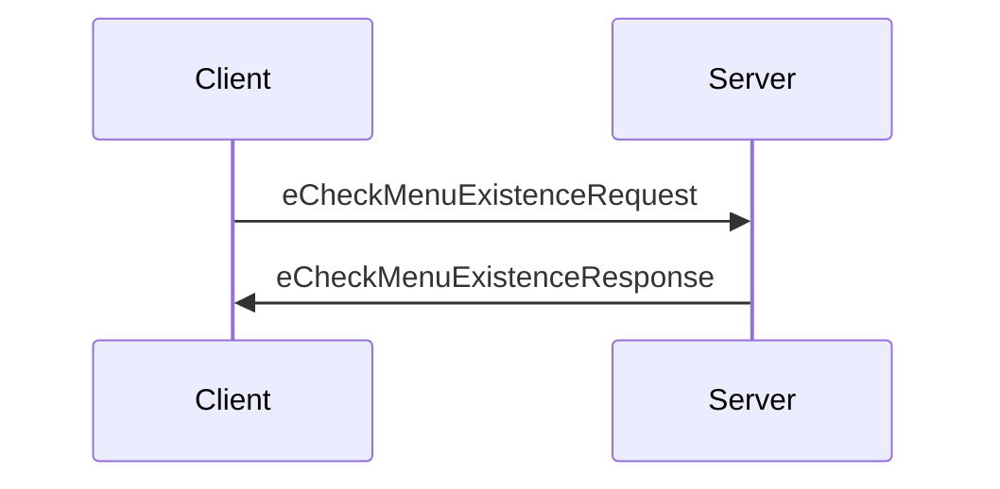
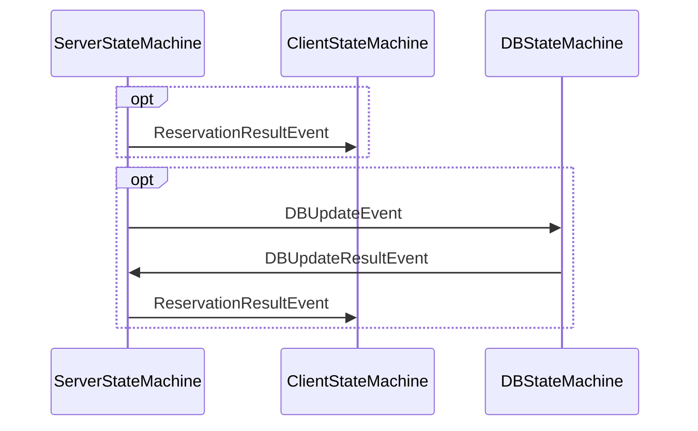
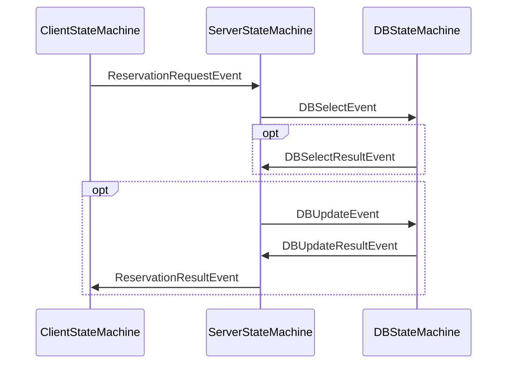
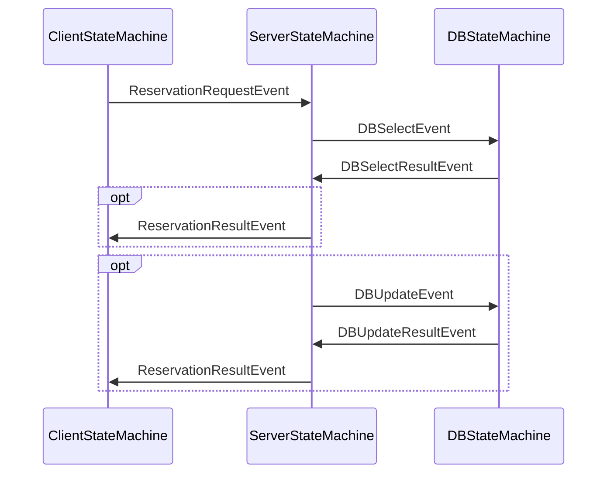

# 設計文書

## 概要

Goソースコードを分析してMermaidシーケンス図を生成する機能。`goat.SendTo()`と`goat.OnEvent`呼び出しを検出し、ステートマシン間の通信を示すシーケンス図を生成します。

## アーキテクチャ

型情報付きAST分析アプローチ：

1. `go/packages`を使用してGoソースファイルを型情報付きで解析
2. ステートマシンの定義順序を抽出（参加者の表示順序として使用）
3. `goat.OnEntry/OnEvent/OnExit`呼び出しを見つけて型情報からステートマシン型を抽出
4. ハンドラ内の`goat.SendTo`呼び出しを見つけ、型情報を使ってターゲットを正確に解決
5. 同一ハンドラから複数のSendToがある場合、それぞれをoptブロックとしてグループ化
6. Mermaidシーケンス図を生成（順序を保持）

## 実装

### ファイル構造

```
/Users/s28578/src/github.com/hono0130/output-mermaid-seq/
├── sequence_diagram.go      # Mermaidシーケンス図生成のすべてのロジック
└── sequence_diagram_test.go # ユニットテスト
```

単一ファイル`sequence_diagram.go`に実装。構成：データ構造、パブリックAPI、パッケージ解析、型解決、フローペアリング、出力生成。

### データ構造

```go
type CommunicationFlow struct {
    From             string // 送信元ステートマシン（例：「Client」）
    To               string // 送信先ステートマシン（例：「Server」）
    EventType        string // 送信されるイベントタイプ（例：「eCheckMenuExistenceRequest」）
    HandlerType      string // 「OnEntry」、「OnEvent」、「OnExit」
    HandlerEventType string // OnEventの場合、処理されるイベントタイプ
    HandlerID        string // 同じハンドラーを識別するためのID（新規追加）
}

// ハンドラ情報
type HandlerInfo struct {
    StateMachineType string       // ステートマシンタイプ（例：「Client」、「Server」）
    Function         *ast.FuncLit // ハンドラ関数ASTノード
    HandlerType      string       // 「OnEntry」、「OnEvent」、「OnExit」
    EventType        string       // OnEventの場合、処理するイベントタイプ
}

// SendTo呼び出し情報
type SendToInfo struct {
    Target ast.Expr // ターゲット式ASTノード
    Event  ast.Expr // イベント式ASTノード
}

// 新規追加：フローグループを表す構造体
type FlowGroup struct {
    Flows      []CommunicationFlow
    IsOptional bool // optブロックとして表示するか
}

// 新規追加：シーケンス図の要素
type SequenceDiagramElement struct {
    Type  string              // "single" or "group"
    Flow  *CommunicationFlow // Type="single"の場合
    Group *FlowGroup         // Type="group"の場合
}
```

### 全体フロー

```go
func AnalyzePackage(packagePath, outputPath string) error {
    // 1. 型情報付きでパッケージをロード
    pkg, err := loadPackageWithTypes(packagePath)
    if err != nil {
        return err
    }

    // 2. ステートマシンの定義順序を抽出
    stateMachineOrder := extractStateMachineOrder(pkg)

    // 3. 通信フローを抽出
    flows := extractCommunicationFlows(pkg)

    // 4. フローを実行パスにグループ化
    elements := buildSequenceDiagramElements(flows)

    // 5. Mermaidを生成（順序を保持）
    mermaidContent := generateMermaidWithGroups(elements, stateMachineOrder)

    // 6. ファイルに書き込み
    return writeFile(outputPath, mermaidContent)
}
```

### 主要関数

```go
// フローを実行パスにグループ化
func buildSequenceDiagramElements(flows []CommunicationFlow) []SequenceDiagramElement {
    var elements []SequenceDiagramElement
    processed := make(map[string]bool)
    
    // ハンドラーごとにフローをグループ化
    handlerGroups := groupFlowsByHandler(flows)
    
    // フローの元の順序を保持するため、flowsを順番に処理
    for _, flow := range flows {
        if processed[flow.HandlerID] {
            continue
        }
        
        handlerFlows := handlerGroups[flow.HandlerID]
        
        if len(handlerFlows) > 1 {
            // 複数のSendToがあるハンドラー：それぞれをoptブロックに
            for _, hFlow := range handlerFlows {
                // このフローと後続フローを収集
                pathFlows := []CommunicationFlow{hFlow}
                pathFlows = append(pathFlows, findSubsequentFlows(hFlow, flows)...)
                
                group := &FlowGroup{
                    Flows:      pathFlows,
                    IsOptional: true,
                }
                elements = append(elements, SequenceDiagramElement{
                    Type:  "group",
                    Group: group,
                })
            }
        } else if len(handlerFlows) == 1 {
            // 単一のSendToのハンドラー
            hFlow := handlerFlows[0]
            subsequentFlows := findSubsequentFlows(hFlow, flows)
            
            if shouldBeOptional(hFlow, subsequentFlows) {
                // optブロックとしてグループ化
                allFlows := []CommunicationFlow{hFlow}
                allFlows = append(allFlows, subsequentFlows...)
                
                group := &FlowGroup{
                    Flows:      allFlows,
                    IsOptional: true,
                }
                elements = append(elements, SequenceDiagramElement{
                    Type:  "group",
                    Group: group,
                })
            } else {
                // 後続フローがない単純なフロー
                elements = append(elements, SequenceDiagramElement{
                    Type: "single",
                    Flow: &hFlow,
                })
            }
        }
        
        processed[flow.HandlerID] = true
        
        // このハンドラーに関連するすべてのフローを処理済みに
        for _, hFlow := range handlerFlows {
            markFlowsAsProcessed(hFlow, flows, processed)
        }
    }
    
    return elements
}

// 関連フローを処理済みにマーク
func markFlowsAsProcessed(flow CommunicationFlow, allFlows []CommunicationFlow, processed map[string]bool) {
    subsequentFlows := findSubsequentFlows(flow, allFlows)
    for _, subFlow := range subsequentFlows {
        processed[subFlow.HandlerID] = true
        markFlowsAsProcessed(subFlow, allFlows, processed)
    }
}

// ハンドラーごとにフローをグループ化
func groupFlowsByHandler(flows []CommunicationFlow) map[string][]CommunicationFlow {
    groups := make(map[string][]CommunicationFlow)
    for _, flow := range flows {
        groups[flow.HandlerID] = append(groups[flow.HandlerID], flow)
    }
    return groups
}

// 特定のフローの後続フローを探索
func findSubsequentFlows(flow CommunicationFlow, allFlows []CommunicationFlow) []CommunicationFlow {
    var subsequent []CommunicationFlow
    
    // このフローが送信したイベントを処理するハンドラーを探す
    for _, candidate := range allFlows {
        if candidate.HandlerType == "OnEvent" && 
           candidate.HandlerEventType == flow.EventType &&
           candidate.From == flow.To {
            subsequent = append(subsequent, candidate)
            // 再帰的に後続を探索
            subsequent = append(subsequent, findSubsequentFlows(candidate, allFlows)...)
        }
    }
    
    return subsequent
}

// optブロックとして表示すべきか判定
func shouldBeOptional(flow CommunicationFlow, subsequentFlows []CommunicationFlow) bool {
    // 単一のSendToでも、後続フローがある場合はoptブロックを使用
    // 例：DBSelectEventの後のDBSelectResultEvent
    return len(subsequentFlows) > 0
}

func extractCommunicationFlows(pkg *packages.Package) []CommunicationFlow {
    var flows []CommunicationFlow
    
    for _, file := range pkg.Syntax {
        handlers := findHandlerRegistrations(file, pkg)
        for _, handler := range handlers {
            sendTos := findSendToCalls(handler.Function)
            for _, sendTo := range sendTos {
                flow := CommunicationFlow{
                    From:             handler.StateMachineType,
                    To:               resolveTargetType(sendTo.Target, pkg),
                    EventType:        extractEventTypeFromExpr(sendTo.Event, pkg),
                    HandlerType:      handler.HandlerType,
                    HandlerEventType: handler.EventType,
                    HandlerID:        generateHandlerID(handler),
                }
                flows = append(flows, flow)
            }
        }
    }
    
    return flows
}

// ハンドラーIDを生成
func generateHandlerID(handler HandlerInfo) string {
    return fmt.Sprintf("%s_%s_%s", 
        handler.StateMachineType, 
        handler.HandlerType, 
        handler.EventType)
}

// ハンドラ登録を検出（統合関数）
func findHandlerRegistrations(file *ast.File, pkg *packages.Package) []HandlerInfo {
    var handlers []HandlerInfo
    
    ast.Inspect(file, func(n ast.Node) bool {
        callExpr, ok := n.(*ast.CallExpr)
        if !ok {
            return true
        }
        
        handler := extractHandlerInfo(callExpr, pkg)
        if handler != nil {
            handlers = append(handlers, *handler)
        }
        
        return true
    })
    
    return handlers
}

// ハンドラ情報を抽出
func extractHandlerInfo(callExpr *ast.CallExpr, pkg *packages.Package) *HandlerInfo {
    handlerType := getHandlerType(callExpr)
    if handlerType == "" {
        return nil
    }
    
    stateMachineType := extractStateMachineTypeFromSpec(callExpr, pkg)
    if stateMachineType == "" {
        return nil
    }
    
    // ハンドラ関数を取得
    handlerFunc := getHandlerFunction(callExpr)
    if handlerFunc == nil {
        return nil
    }
    
    var eventType string
    if handlerType == "OnEvent" {
        eventType = extractEventTypeFromCallExpr(callExpr, pkg)
    }
    
    return &HandlerInfo{
        StateMachineType: stateMachineType,
        Function:         handlerFunc,
        HandlerType:      handlerType,
        EventType:        eventType,
    }
}

// SendTo呼び出しを検出
func findSendToCalls(handlerFunc *ast.FuncLit) []SendToInfo {
    var sendTos []SendToInfo
    
    ast.Inspect(handlerFunc.Body, func(n ast.Node) bool {
        callExpr, ok := n.(*ast.CallExpr)
        if !ok {
            return true
        }
        
        if isSendToCall(callExpr) && len(callExpr.Args) >= 3 {
            sendTos = append(sendTos, SendToInfo{
                Target: callExpr.Args[1],
                Event:  callExpr.Args[2],
            })
        }
        
        return true
    })
    
    return sendTos
}

// Mermaid生成（グループ化対応）
func generateMermaidWithGroups(elements []SequenceDiagramElement, participantOrder []string) string {
    var sb strings.Builder
    sb.WriteString("sequenceDiagram\n")
    
    // 参加者の宣言
    for _, participant := range participantOrder {
        sb.WriteString(fmt.Sprintf("    participant %s\n", participant))
    }
    
    // 空行を追加
    sb.WriteString("\n")
    
    // フローの出力（順序を保持）
    for _, element := range elements {
        switch element.Type {
        case "single":
            sb.WriteString(fmt.Sprintf("    %s->>%s: %s\n", 
                element.Flow.From, element.Flow.To, element.Flow.EventType))
                
        case "group":
            if element.Group.IsOptional {
                sb.WriteString("    opt\n")
                for _, f := range element.Group.Flows {
                    sb.WriteString(fmt.Sprintf("        %s->>%s: %s\n", 
                        f.From, f.To, f.EventType))
                }
                sb.WriteString("    end\n")
            } else {
                // optでないグループ
                for _, f := range element.Group.Flows {
                    sb.WriteString(fmt.Sprintf("    %s->>%s: %s\n", 
                        f.From, f.To, f.EventType))
                }
            }
        }
    }
    
    // 末尾に空行を追加
    sb.WriteString("\n")
    
    return sb.String()
}

func writeFile(outputPath, content string) error {
    // 出力ディレクトリが存在しない場合は作成
    dir := filepath.Dir(outputPath)
    if err := os.MkdirAll(dir, 0755); err != nil {
        return fmt.Errorf("failed to create output directory: %w", err)
    }
    
    // ファイルに書き込み
    if err := os.WriteFile(outputPath, []byte(content), 0644); err != nil {
        return fmt.Errorf("failed to write file: %w", err)
    }
    
    return nil
}
```

### ヘルパー関数

```go
// ハンドラータイプを取得
func getHandlerType(callExpr *ast.CallExpr) string {
    selExpr, ok := callExpr.Fun.(*ast.SelectorExpr)
    if !ok {
        return ""
    }
    
    if !isGoatSelector(selExpr) {
        return ""
    }
    
    switch selExpr.Sel.Name {
    case "OnEntry", "OnEvent", "OnExit":
        return selExpr.Sel.Name
    default:
        return ""
    }
}

// goatパッケージのセレクターか確認
func isGoatSelector(selExpr *ast.SelectorExpr) bool {
    ident, ok := selExpr.X.(*ast.Ident)
    return ok && ident.Name == "goat"
}

// ハンドラ関数を取得
func getHandlerFunction(callExpr *ast.CallExpr) *ast.FuncLit {
    if len(callExpr.Args) == 0 {
        return nil
    }
    
    // 最後の引数がハンドラ関数
    lastArg := callExpr.Args[len(callExpr.Args)-1]
    funcLit, ok := lastArg.(*ast.FuncLit)
    if !ok {
        return nil
    }
    
    return funcLit
}

// OnEventのイベントタイプを抽出
func extractEventTypeFromCallExpr(callExpr *ast.CallExpr, pkg *packages.Package) string {
    if len(callExpr.Args) < 3 {
        return ""
    }
    
    // OnEventの第3引数がイベントタイプ
    return extractEventTypeFromExpr(callExpr.Args[2], pkg)
}

// SendTo呼び出しか確認
func isSendToCall(callExpr *ast.CallExpr) bool {
    selExpr, ok := callExpr.Fun.(*ast.SelectorExpr)
    if !ok {
        return false
    }
    
    return isGoatSelector(selExpr) && selExpr.Sel.Name == "SendTo"
}

// ステートマシンの定義順序を抽出
func extractStateMachineOrder(pkg *packages.Package) []string {
    var stateMachineOrder []string
    seenStateMachines := make(map[string]bool)
    
    for _, file := range pkg.Syntax {
        ast.Inspect(file, func(n ast.Node) bool {
            typeSpec, ok := n.(*ast.TypeSpec)
            if !ok {
                return true
            }
            
            if isStateMachineStruct(typeSpec) {
                name := typeSpec.Name.Name
                if !seenStateMachines[name] {
                    stateMachineOrder = append(stateMachineOrder, name)
                    seenStateMachines[name] = true
                }
            }
            return true
        })
    }
    
    return stateMachineOrder
}

// ステートマシン構造体か確認
func isStateMachineStruct(typeSpec *ast.TypeSpec) bool {
    structType, ok := typeSpec.Type.(*ast.StructType)
    if !ok {
        return false
    }
    
    for _, field := range structType.Fields.List {
        if field.Names != nil { // not an embedded field
            continue
        }
        
        selExpr, ok := field.Type.(*ast.SelectorExpr)
        if !ok {
            continue
        }
        
        ident, ok := selExpr.X.(*ast.Ident)
        if !ok {
            continue
        }
        
        if ident.Name == "goat" && selExpr.Sel.Name == "StateMachine" {
            return true
        }
    }
    
    return false
}
```

### フロー解析の詳細

**optブロック生成のルール：**

1. **同一ハンドラから複数のSendTo**：それぞれのパスをoptブロックとして表現
2. **単一SendToでも後続がある場合**：optブロックを使用
3. **順序の保持**：元のフロー順序を維持しながらグループ化

**重要なポイント：**
- 矢印の順序は意味を持つため、元の実行順序を厳密に保持
- 後続フローが処理されたら、重複を避けるため処理済みマーク

## 例

### 例1: シンプルなリクエスト-レスポンス

**入力コード**：

```go
goat.OnEntry(clientSpec, clientIdle, func(ctx context.Context, client *Client) {
    goat.SendTo(ctx, client.Server, &eCheckMenuExistenceRequest{})
})

goat.OnEvent(serverSpec, serverRunning, &eCheckMenuExistenceRequest{},
    func(ctx context.Context, event *eCheckMenuExistenceRequest, server *Server) {
        goat.SendTo(ctx, event.From, &eCheckMenuExistenceResponse{})
    },
)
```

**生成されるMermaid**：



### 例2: 条件分岐を含むフロー

**入力コード**：

```go
goat.OnEvent(serverSpec, serverProcessing, &DBSelectResultEvent{},
    func(ctx context.Context, event *DBSelectResultEvent, server *ServerStateMachine) {
        if event.IsReserved {
            // 予約済みの場合
            goat.SendTo(ctx, server.CurrentRequest.Client, &ReservationResultEvent{Succeeded: false})
        } else {
            // 予約可能な場合
            goat.SendTo(ctx, server.DB, &DBUpdateEvent{})
        }
    })
```

**生成されるMermaid**：



## パブリックAPI

```go
// パッケージを分析してMermaidファイルを生成
func AnalyzePackage(packagePath, outputPath string) error
```

**使用方法**：

```go
err := mermaid.AnalyzePackage("./example/client-server", "./diagram.md")
```

## 型情報ベースの実装詳細

### パッケージロード

```go
import "golang.org/x/tools/go/packages"

func loadPackageWithTypes(packagePath string) (*packages.Package, error) {
    cfg := &packages.Config{
        Mode: packages.NeedTypes | packages.NeedSyntax | packages.NeedTypesInfo,
        Dir:  packagePath,
    }
    pkgs, err := packages.Load(cfg, ".")
    if err != nil {
        return nil, err
    }
    
    if len(pkgs) != 1 {
        return nil, fmt.Errorf("expected 1 package, got %d", len(pkgs))
    }
    
    return pkgs[0], nil
}
```

### 型解決関数

```go
func extractStateMachineTypeFromSpec(specExpr ast.Expr, pkg *packages.Package) string {
    // specの型情報を取得: *goat.Spec[*Client]
    if tv, ok := pkg.TypesInfo.Types[specExpr]; ok {
        typ := tv.Type
        
        // ジェネリック型パラメータを取得
        if named, ok := typ.(*types.Named); ok {
            if typeArgs := named.TypeArgs(); typeArgs.Len() > 0 {
                arg := typeArgs.At(0) // *Client
                if ptr, ok := arg.(*types.Pointer); ok {
                    if elem, ok := ptr.Elem().(*types.Named); ok {
                        return elem.Obj().Name() // "Client"
                    }
                }
            }
        }
    }
    return ""
}

func resolveTargetType(targetExpr ast.Expr, pkg *packages.Package) string {
    // targetの型情報を取得
    if tv, ok := pkg.TypesInfo.Types[targetExpr]; ok {
        typ := tv.Type
        
        // ポインタ型の場合、基底型を取得
        if ptr, ok := typ.(*types.Pointer); ok {
            typ = ptr.Elem()
        }
        
        // 型名を取得
        if named, ok := typ.(*types.Named); ok {
            return named.Obj().Name()
        }
    }
    return "Unknown"
}
```

### 解決される問題

1. **event.From** → `*Client`型として解決 → "Client"
2. **dbSpec** → `*goat.Spec[*DBStateMachine]`として解決 → "DBStateMachine"  
3. **client.Server** → `*Server`型として解決 → "Server"

### 追加の型解決関数

```go
// specからステートマシンタイプを抽出
func extractStateMachineTypeFromSpec(callExpr *ast.CallExpr, pkg *packages.Package) string {
    if len(callExpr.Args) == 0 {
        return ""
    }
    
    specExpr := callExpr.Args[0]
    specType := getTypeOfExpression(specExpr, pkg)
    if specType == nil {
        return ""
    }
    
    return extractTypeFromGeneric(specType)
}

// 式の型を取得
func getTypeOfExpression(expr ast.Expr, pkg *packages.Package) types.Type {
    tv, ok := pkg.TypesInfo.Types[expr]
    if !ok {
        return nil
    }
    return tv.Type
}

// ジェネリック型からステートマシンタイプを抽出
func extractTypeFromGeneric(typ types.Type) string {
    // ポインタ型の場合、基底型を取得
    if ptr, ok := typ.(*types.Pointer); ok {
        typ = ptr.Elem()
    }
    
    // goat.StateMachineSpec[*Type]パターンを探す
    named, ok := typ.(*types.Named)
    if !ok {
        return ""
    }
    
    typeArgs := named.TypeArgs()
    if typeArgs == nil || typeArgs.Len() == 0 {
        return ""
    }
    
    // 最初の型引数を取得: *StateMachineType
    arg := typeArgs.At(0)
    ptr, ok := arg.(*types.Pointer)
    if !ok {
        return ""
    }
    
    elem, ok := ptr.Elem().(*types.Named)
    if !ok {
        return ""
    }
    
    return elem.Obj().Name()
}

// イベント型名を抽出
func extractEventTypeFromExpr(eventExpr ast.Expr, pkg *packages.Package) string {
    typeName := extractTypeNameFromExpr(eventExpr, pkg)
    if typeName != "" {
        return typeName
    }
    return extractEventTypeFromAST(eventExpr)
}

// 式から型名を抽出
func extractTypeNameFromExpr(expr ast.Expr, pkg *packages.Package) string {
    typ := getTypeOfExpression(expr, pkg)
    if typ == nil {
        return ""
    }
    
    if ptr, ok := typ.(*types.Pointer); ok {
        typ = ptr.Elem()
    }
    
    if named, ok := typ.(*types.Named); ok {
        return named.Obj().Name()
    }
    
    return ""
}

// ASTからイベントタイプを抽出（フォールバック）
func extractEventTypeFromAST(expr ast.Expr) string {
    switch e := expr.(type) {
    case *ast.UnaryExpr:
        if e.Op == token.AND {
            if comp, ok := e.X.(*ast.CompositeLit); ok {
                if ident, ok := comp.Type.(*ast.Ident); ok {
                    return ident.Name
                }
            }
        }
    case *ast.CompositeLit:
        if ident, ok := e.Type.(*ast.Ident); ok {
            return ident.Name
        }
    }
    return ""
}
```

### 期待される出力

**client-server example:**


**meeting-room-reservation without-exclusion example:**


**meeting-room-reservation with-exclusion example:**


### 依存関係

```go
import "golang.org/x/tools/go/packages"
```

### まとめ

この設計により：

1. **正確な型解決**：`go/packages`を使用して型情報を取得し、正確なターゲットとイベントタイプを解決
2. **optブロックの適切な生成**：同一ハンドラからの複数SendToや、後続フローがある場合に適切にoptブロックを生成
3. **順序の保持**：元のフロー順序を厳密に保持し、意味のあるシーケンス図を生成
4. **重複の回避**：後続フローを処理済みとしてマークし、重複を避ける

これにより、テストで期待される出力と一致するMermaidシーケンス図が生成されます。