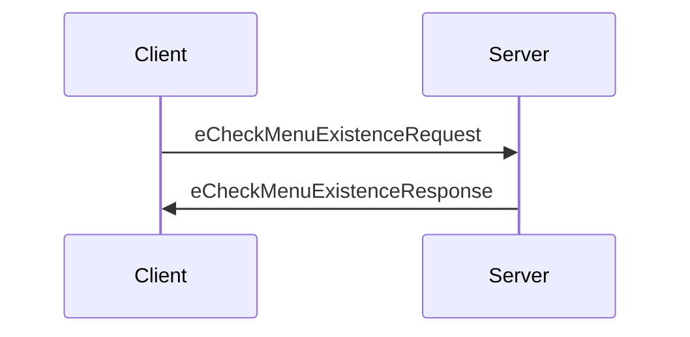
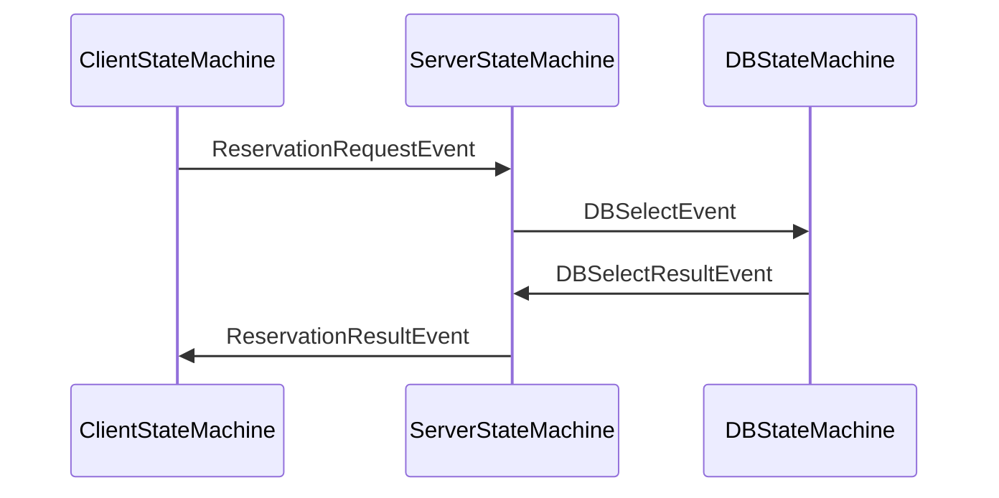

# 設計文書

## 概要

この設計は、Goソースコードを分析してMermaidシーケンス図を生成する機能をgoatに追加します。このツールはイベントハンドラ内の`goat.SendTo()`呼び出しと`goat.OnEvent`呼び出しを検出し、ステートマシン間の通信を示すシーケンス図を生成します。既存のユーザーコードへの変更は不要です。

## アーキテクチャ

型情報付きAST分析アプローチ：

1. `go/packages`を使用してGoソースファイルを型情報付きで解析
2. `goat.OnEntry/OnEvent/OnExit`呼び出しを見つけて型情報からステートマシン型を抽出
3. ハンドラ内の`goat.SendTo`呼び出しを見つけ、型情報を使ってターゲットを正確に解決
4. リクエスト・レスポンスペアを構築
5. Mermaidシーケンス図を生成

## 実装

### ファイル構造

```
/Users/s28578/src/github.com/hono0130/output-mermaid-seq/
├── sequence_diagram.go      # Mermaidシーケンス図生成のすべてのロジック
└── sequence_diagram_test.go # ユニットテスト
```

実装はシンプルで保守しやすくするため、単一ファイル`sequence_diagram.go`に含まれます。ファイルは以下のように構成されます：

1. **データ構造** - コアタイプ（`CommunicationFlow`、`HandlerInfo`、`SendToInfo`）
2. **パブリックAPI** - エントリポイント関数（`AnalyzePackage`）
3. **パッケージ解析** - `go/packages`を使った型情報付き解析
4. **型解決** - 式の実際の型を解決するための関数
5. **フローペアリング** - リクエスト・レスポンスパターンのマッチング用ロジック
6. **出力生成** - Mermaid構文生成とファイル書き込み

### データ構造

```go
type CommunicationFlow struct {
    From             string // 送信元ステートマシン（例：「Client」）
    To               string // 送信先ステートマシン（例：「Server」）
    EventType        string // 送信されるイベントタイプ（例：「eCheckMenuExistenceRequest」）
    HandlerType      string // 「OnEntry」、「OnEvent」、「OnExit」
    HandlerEventType string // OnEventの場合、処理されるイベントタイプ
}

// 新規追加：イベントハンドラのマッピング
type EventHandlerMapping struct {
    EventType        string       // 処理するイベントタイプ (例: "eCheckMenuExistenceRequest")
    StateMachineType string       // ハンドラを持つステートマシン (例: "Server")
    HandlerFunc      *ast.FuncLit // ハンドラ関数のAST
}
```

### 主要関数

```go
func AnalyzePackage(packagePath, outputPath string) error {
    // 1. Goファイルを解析
    files, err := parseGoFiles(packagePath)
    if err != nil {
        return err
    }

    // 2. 通信フローを抽出
    flows := extractCommunicationFlows(files)

    // 3. Mermaidを生成
    mermaidContent := generateMermaid(flows)

    // 4. ファイルに書き込み
    return writeFile(outputPath, mermaidContent)
}

func parseGoFiles(packagePath string) ([]*ast.File, error)

func extractCommunicationFlows(files []*ast.File) []CommunicationFlow {
    // 1. すべてのOnEventハンドラを収集してインデックス化
    eventHandlers := collectAndIndexOnEventHandlers(files)
    
    // 2. OnEntry/OnTransition/OnExit/OnHaltハンドラを収集
    initialHandlers := collectInitialHandlers(files)
    
    var flows []CommunicationFlow
    
    // 3. 各初期ハンドラからイベントチェーンを辿る
    for _, handler := range initialHandlers {
        sendTos := findSendToCalls(handler.Function)
        
        for _, sendTo := range sendTos {
            // SendToを記録
            flow := CommunicationFlow{
                From:             handler.StateMachineType,
                To:               resolveTargetName(sendTo.Target),
                EventType:        extractEventType(sendTo.Event),
                HandlerType:      handler.HandlerType,
                HandlerEventType: "",
            }
            flows = append(flows, flow)
            
            // このSendToからイベントチェーンを辿る
            chainFlows := traceEventChainFromSendTo(sendTo, handler.StateMachineType, 
                                                   eventHandlers, make(map[string]bool))
            flows = append(flows, chainFlows...)
        }
    }
    
    return flows
}


// OnEntry/OnTransition/OnExit/OnHaltハンドラを検出
func collectInitialHandlers(files []*ast.File) []HandlerInfo {
    var handlers []HandlerInfo
    
    for _, file := range files {
        // goat.OnEntry()、goat.OnTransition()、goat.OnExit()、goat.OnHalt()呼び出しを検出
        // specパラメータの型からステートマシンタイプを抽出
        // 例：spec *goat.Spec[*Client] -> 「Client」
        handlers = append(handlers, findOnEntryHandlers(file)...)
        handlers = append(handlers, findOnTransitionHandlers(file)...)
        handlers = append(handlers, findOnExitHandlers(file)...)
        handlers = append(handlers, findOnHaltHandlers(file)...)
    }
    
    return handlers
}
    
    return handlers
}

// OnEventハンドラを検出
func findOnEventHandlers(file *ast.File) []EventHandlerMapping {
    // goat.OnEvent()呼び出しを検出
    // 第3引数からイベントタイプを抽出 (&eCheckMenuExistenceRequest{})
    // specパラメータからステートマシンタイプを抽出
}

func findSendToCalls(handlerFunc *ast.FuncLit) []SendToInfo {
    // goat.SendTo(ctx, target, event)呼び出しを抽出
}

// SendToからイベントチェーンを辿る
func traceEventChainFromSendTo(sendTo SendToInfo, 
                               fromMachine string,
                               eventHandlers map[string][]EventHandlerMapping,
                               visited map[string]bool) []CommunicationFlow {
    var flows []CommunicationFlow
    
    eventType := extractEventType(sendTo.Event)
    targetMachine := resolveTargetName(sendTo.Target)
    
    // 送信されたイベントを処理するOnEventハンドラを検索
    chainKey := fmt.Sprintf("%s-%s-%s", targetMachine, eventType, fromMachine)
    if !visited[chainKey] {
        visited[chainKey] = true
        
        if handlers, ok := eventHandlers[eventType]; ok {
            for _, h := range handlers {
                // ターゲットマシンが一致するハンドラを探す
                if h.StateMachineType == targetMachine {
                    // OnEventハンドラ内のSendToを検出
                    innerSendTos := findSendToCalls(h.HandlerFunc)
                    
                    for _, innerSendTo := range innerSendTos {
                        // OnEventからのSendToを記録
                        flow := CommunicationFlow{
                            From:             h.StateMachineType,
                            To:               resolveTargetName(innerSendTo.Target),
                            EventType:        extractEventType(innerSendTo.Event),
                            HandlerType:      "OnEvent",
                            HandlerEventType: eventType,
                        }
                        flows = append(flows, flow)
                        
                        // さらに連鎖を辿る
                        chainFlows := traceEventChainFromSendTo(innerSendTo, h.StateMachineType,
                                                               eventHandlers, visited)
                        flows = append(flows, chainFlows...)
                    }
                }
            }
        }
    }
    
    return flows
}

func resolveTargetName(targetExpr string) string {
    // 「client.Server」 -> 「Server」
    // 「event.From」 -> 送信者の型
}

func extractEventType(eventExpr string) string {
    // 「&eCheckMenuExistenceRequest{}」 -> 「eCheckMenuExistenceRequest」
}

func resolveTargetName(targetExpr string) string {
    // 「client.Server」 -> 「Server」
    // 「event.From」 -> 送信者の型
}

func extractEventType(eventExpr string) string {
    // 「&eCheckMenuExistenceRequest{}」 -> 「eCheckMenuExistenceRequest」
}

func generateMermaid(flows []CommunicationFlow) string {
    // Mermaidシーケンス図構文を生成
}

func writeFile(outputPath, content string) error

// OnEventハンドラを収集してインデックス化
func collectAndIndexOnEventHandlers(files []*ast.File) map[string][]EventHandlerMapping {
    eventHandlers := make(map[string][]EventHandlerMapping)
    
    for _, file := range files {
        handlers := findOnEventHandlers(file)
        for _, h := range handlers {
            eventHandlers[h.EventType] = append(eventHandlers[h.EventType], h)
        }
    }
    
    return eventHandlers
}
}
```

### ヘルパーデータ構造

```go
type HandlerInfo struct {
    StateMachineType string       // ステートマシンタイプ（例：「Client」、「Server」）
    Function         *ast.FuncLit // ハンドラ関数ASTノード
    HandlerType      string       // 「OnEntry」、「OnTransition」、「OnExit」、「OnHalt」
}

type SendToInfo struct {
    Target string // ターゲット式（例：「client.Server」）
    Event  string // イベント式（例：「&eCheckMenuExistenceRequest{}」）
}
```

## 例

**入力コード**：

```go
goat.OnEntry(clientSpec, clientIdle, func(ctx context.Context, client *Client) {
    goat.SendTo(ctx, client.Server, &eCheckMenuExistenceRequest{})
})

goat.OnEvent(serverSpec, serverRunning, &eCheckMenuExistenceRequest{},
    func(ctx context.Context, event *eCheckMenuExistenceRequest, server *Server) {
        goat.SendTo(ctx, event.From, &eCheckMenuExistenceResponse{})
    },
)
```

**生成されるMermaid**：


```mermaid
sequenceDiagram
    participant Client
    participant Server
    Client->>Server: eCheckMenuExistenceRequest
    Server->>Client: eCheckMenuExistenceResponse
```

## パブリックAPI

```go
// パッケージを分析してMermaidファイルを生成
func AnalyzePackage(packagePath, outputPath string) error
```

**使用方法**：

```go
err := mermaid.AnalyzePackage("./example/client-server", "./diagram.md")
```

## 型情報ベースの実装詳細

### パッケージロード

```go
import "golang.org/x/tools/go/packages"

func loadPackageWithTypes(packagePath string) (*packages.Package, error) {
    cfg := &packages.Config{
        Mode: packages.NeedTypes | packages.NeedSyntax | packages.NeedTypesInfo,
        Dir:  packagePath,
    }
    pkgs, err := packages.Load(cfg, ".")
    if err != nil {
        return nil, err
    }
    
    if len(pkgs) != 1 {
        return nil, fmt.Errorf("expected 1 package, got %d", len(pkgs))
    }
    
    return pkgs[0], nil
}
```

### 型解決関数

```go
func extractStateMachineTypeFromSpec(specExpr ast.Expr, pkg *packages.Package) string {
    // specの型情報を取得: *goat.Spec[*Client]
    if tv, ok := pkg.TypesInfo.Types[specExpr]; ok {
        typ := tv.Type
        
        // ジェネリック型パラメータを取得
        if named, ok := typ.(*types.Named); ok {
            if typeArgs := named.TypeArgs(); typeArgs.Len() > 0 {
                arg := typeArgs.At(0) // *Client
                if ptr, ok := arg.(*types.Pointer); ok {
                    if elem, ok := ptr.Elem().(*types.Named); ok {
                        return elem.Obj().Name() // "Client"
                    }
                }
            }
        }
    }
    return ""
}

func resolveTargetType(targetExpr ast.Expr, pkg *packages.Package) string {
    // targetの型情報を取得
    if tv, ok := pkg.TypesInfo.Types[targetExpr]; ok {
        typ := tv.Type
        
        // ポインタ型の場合、基底型を取得
        if ptr, ok := typ.(*types.Pointer); ok {
            typ = ptr.Elem()
        }
        
        // 型名を取得
        if named, ok := typ.(*types.Named); ok {
            return named.Obj().Name()
        }
    }
    return "Unknown"
}
```

### 解決される問題

1. **event.From** → `*Client`型として解決 → "Client"
2. **dbSpec** → `*goat.Spec[*DBStateMachine]`として解決 → "DBStateMachine"  
3. **client.Server** → `*Server`型として解決 → "Server"

### 期待される出力

**client-server example:**

```mermaid
sequenceDiagram
    participant Client
    participant Server
    Client->>Server: eCheckMenuExistenceRequest
    Server->>Client: eCheckMenuExistenceResponse
```

**meeting-room-reservation example:**

```mermaid
sequenceDiagram
    participant ClientStateMachine
    participant ServerStateMachine
    participant DBStateMachine
    ClientStateMachine->>ServerStateMachine: ReservationRequestEvent
    ServerStateMachine->>DBStateMachine: DBSelectEvent
    DBStateMachine->>ServerStateMachine: DBSelectResultEvent
    ServerStateMachine->>ClientStateMachine: ReservationResultEvent
```

### 依存関係

```go
import "golang.org/x/tools/go/packages"
```

この変更により、正確な型解決が可能になり、現在の問題（`event.From`の誤解決、不完全なステートマシン検出）が解決されます。